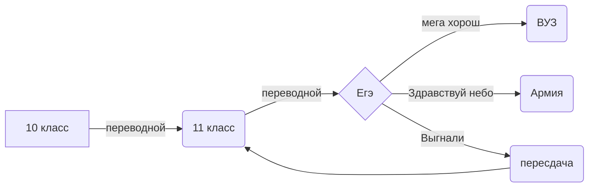

INF
# Рибсам Эд 142 группа

Список файлов:

__Рибсам Эд.xlsx__ - _таблица умножения / перевод чисел различных систем исчисления_

__пшол вон оно работает.py__ - _перевод чисел в N-ичную систему_

__пшол вон оно работает но на паскале.pas__ - _паскальная версия перевода чисел в N-ичную систему_

__логика.xlsx__ - _логические выражения в excel_

__абоба.png__ - _действия "автокликкера" в paint_

__морзилка.py__ - _азбука морзе на питохе_

__нейронки.png__ - _нейронные сети_

__Idempotentcy law.md__ - _Булева логика | закон идемпотентности_

https://tproger.ru/articles/programmirovanie-na-python-v-minecraft-besplatnye-videouroki-dlja-detej-i-podrostkov-dlja-detej-ot-9-let/
